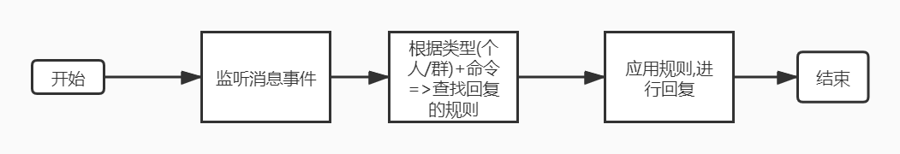
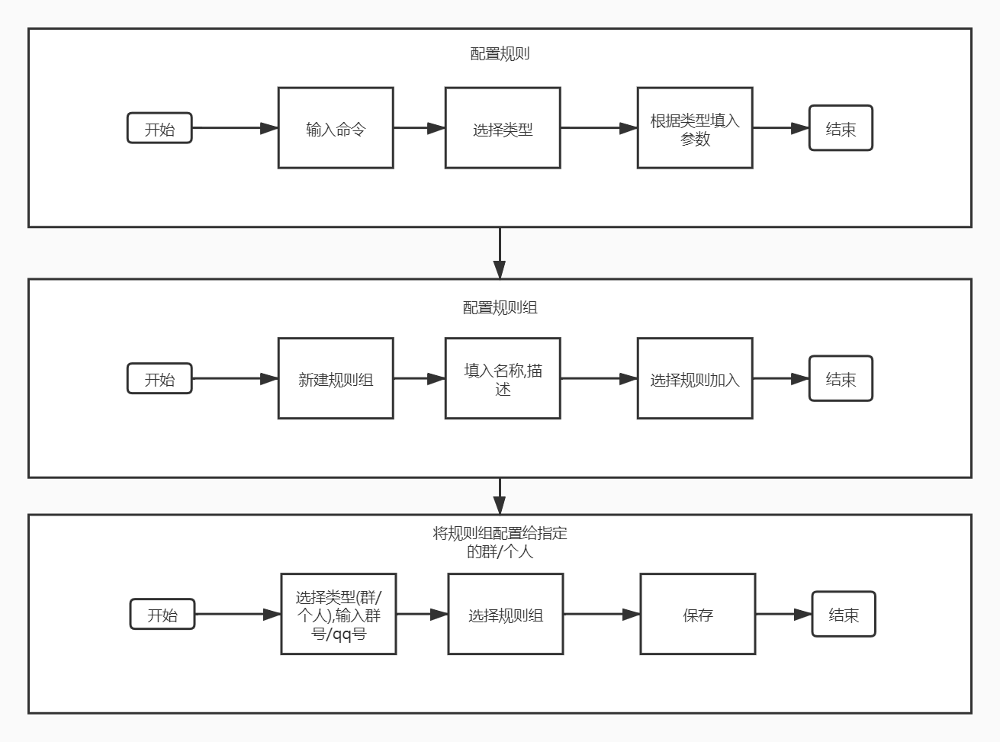

# MiraiGo-Bot
增强MiraiGo-Bot,开箱可用,降低使用成本

## 功能
* [ ] 使用`sqlite3`存储数据,使用`migrations`同步数据库
* [ ] 实现`miraigo-module`
  * [ ] 回复模板和参数组
    * `${index}` 输入参数 如`.command 1 2` `${1}`即为`1`
    * `${nickName}` 昵称
    * `${answer}` 回复的值
  * [ ] 支持多种类的回复类型

    是否实现|类型|编码|描述
    -|-|-|-
    N|文本|text|返回固定文本
    N|随机数|randomMath|返回`[min,max]`中的整数值
    N|固定随机数|fixedRandomMath|返回`[min,max]`中的整数值,按自然天固定
    N|随机项|randomItem|返回`[a,b,c,d,e]`中任意个数
    ...|

  * [ ] 支持定向回复
* [ ] 支持web端对回复进行配置
* [ ] 支持通过回复进行配置?
* [ ] 缓存支持

## 流程
### 运行流程

### 配置流程

## 依赖项目
* https://github.com/Mrs4s/MiraiGo
* https://github.com/Logiase/MiraiGo-Template
* https://github.com/golang-migrate/migrate/v4
* https://github.com/mattn/go-sqlite3
...更多见[`go.mod`](go.mod)